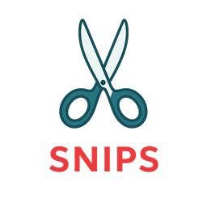

# Snips

[](https://github.com/utensils/snips/actions/workflows/rust.yml)
[](https://github.com/utensils/snips/actions/workflows/build.yml)
[](https://codecov.io/gh/utensils/snips)
[](https://github.com/utensils/snips/actions/workflows/license-check.yml)

<div align="center">
  

A macOS-native snippet management tool designed for building LLM prompts from reusable text snippets.

Quick access via global shortcuts enables efficient search, selection, and combination of multiple snippets.

</div>

## Features

- **Quick Snippet Capture**: Global shortcut (`Cmd+Shift+A`) to save selected text as a snippet
- **Fast Search**: Full-text search with FTS5 across snippet names and tags (`Cmd+Shift+S`)
- **Multi-Select**: Select and combine multiple snippets into a single clipboard entry
- **Usage Analytics**: Track snippet usage frequency to improve search ranking
- **Menubar Integration**: Persistent menubar icon with selection count badge
- **Local-First**: SQLite storage for fast, offline-ready performance

## Technology Stack

- **Framework**: Tauri 2.x (Rust + Web frontend)
- **Frontend**: React with TypeScript
- **Styling**: TailwindCSS
- **Database**: SQLite with FTS5 full-text search
- **State Management**: Zustand
- **Build Tool**: Vite
- **Testing**: Vitest + React Testing Library

## Getting Started

### Prerequisites

- **Node.js** >= 18.0.0
- **Rust** >= 1.82.0 (⚠️ **Important**: Tauri dependencies require Rust 1.82+)
- **npm** >= 9.0.0
- **[mise](https://mise.jdx.dev/)** (recommended for version management)

### Installation

```bash
# Clone the repository
git clone git@github.com:utensils/snips.git
cd snips

# Install required tool versions (if using mise)
mise install

# Install npm dependencies
npm install

# IMPORTANT: Restart your shell after mise install to use the correct Rust version
# Then verify Rust version:
rustc --version  # Should show 1.82.0 or higher
```

**Note**: If you don't use `mise`, ensure you have Rust 1.82+ installed manually via [rustup](https://rustup.rs/).

### Development

```bash
# Run in development mode with hot-reload
npm run tauri dev

# Build for production
npm run tauri build
```

The compiled application will be in `src-tauri/target/release/`.

### Common Commands

```bash
# Code quality
npm run check-all          # Run all checks before committing
npm run format             # Format code
npm run lint               # Lint TypeScript/React

# Testing
npm run test               # Run tests in watch mode
npm run test:coverage      # Generate coverage report

# Rust
cargo fmt                  # Format Rust code
cargo clippy               # Lint Rust code
cargo test                 # Run Rust tests
```

## Project Structure

```
snips/
├── src/                    # Frontend source
│   ├── components/        # React components
│   ├── hooks/            # Custom React hooks
│   ├── stores/           # Zustand stores
│   ├── lib/              # Utilities and helpers
│   └── types/            # TypeScript type definitions
├── src-tauri/             # Tauri/Rust backend
│   ├── src/
│   │   ├── commands/     # Tauri command handlers
│   │   ├── services/     # Business logic
│   │   ├── models/       # Data structures
│   │   └── main.rs       # Application entry point
│   └── Cargo.toml
├── public/               # Static assets
└── package.json

```

## Contributing

We welcome contributions! Follow these steps:

1. **Fork and clone** the repository
2. **Create a branch**: `git checkout -b feature/your-feature-name`
3. **Make your changes** following our [coding standards](STANDARDS.md)
4. **Run quality checks**: `npm run check-all`
5. **Commit** using [Conventional Commits](https://www.conventionalcommits.org/) (e.g., `feat(search): add fuzzy matching`)
6. **Push and create a Pull Request**

### Standards

- All code must pass ESLint/Clippy with no warnings
- All code must be formatted with Prettier/rustfmt
- All tests must pass; new features require tests
- TypeScript strict mode must be satisfied
- No `any` types or Rust `unwrap()` in production code

Git hooks automatically run formatting, linting, and type checking on commit.

See [STANDARDS.md](STANDARDS.md) for complete guidelines.

## Documentation

- [VISION.md](VISION.md) - Product vision and roadmap
- [TECH_DESIGN.md](TECH_DESIGN.md) - Technical architecture
- [STANDARDS.md](STANDARDS.md) - Coding standards

## Recommended IDE Setup

[VS Code](https://code.visualstudio.com/) with extensions: [Tauri](https://marketplace.visualstudio.com/items?itemName=tauri-apps.tauri-vscode), [rust-analyzer](https://marketplace.visualstudio.com/items?itemName=rust-lang.rust-analyzer), [ESLint](https://marketplace.visualstudio.com/items?itemName=dbaeumer.vscode-eslint), [Prettier](https://marketplace.visualstudio.com/items?itemName=esbenp.prettier-vscode)

## License

MIT License - see [LICENSE](LICENSE) for details.

## Support

For issues or questions, please [open an issue](../../issues) on GitHub.
